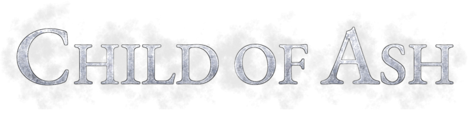

## Wait... What?

While all the usual characters were out and about doing their fightin', there was one young girl doing some adventuring of her own. **Marisa the Ashen**, an aspiring **Anarukon** spellsword and faithful roommate of **Ibuki Miyamoto**. She saw what her good friend was doing, and she wanted to earn some glory of her own too, fighting demons, magic beasts, or whatever else she wished to encounter.

This side mod serves as a bit of a *"coda"* for the entire **DEMOLITIONIST** series, and shines some light into a somewhat neglected character that I very much care about, as we share a name. Now let **Marisa** unleash her powers unto the vile hordes of Hell, or the wicked armies of the Serpent Riders, whichever it may be... They will all burn to ashes at her hands.

---

## Abilities

Being **Anarukon**, **Marisa** has the ability to disintegrate and regenerate her own body on death *(a process known as **"Scattering"**)*, which effectively means she can respawn indefinitely, so there is no real *"game over"* here besides you the player giving up on fighting. It's just like **Dark Souls**!

Anyway, you may be wondering where this character even comes from. Well, she's basically, the character I played as in **Dark Souls 3**. Yes, you heard that right, I turned my player character into an OC, because that's how I roll. Oh, and she was also my **Code Vein** character too, which is where her more anime-y design comes from *(as well as her boyfriend, more on that later)*.

OK, enough sidetracking, let's focus on the stuff™. As any typical **Anarukon** warrior, you've got access to a dedicated *"bag of holding"* where you can fit all your items and weapons that aren't in use. There's a total of six weapons *(plus melee)* that you can bring with yourself, and three always-available spells that you can cycle from and cast at will, with any weapon active.

**Marisa** isn't very fast, not very mobile, but she compensates for this by being basically a *"mighty glacier"*. Her damage resistances are something to behold, and there's additionally the fact that her weapons tend to be very... Massive. She can also swim with ease, even while wielding massive weapons, so you don't need to worry about sinking, and of course, she also has methods for breathing underwater *(as does her boyfriend, again, more on that later)*.

---

## Weaponry

**Marisa**'s arsenal is quite limited. She's not big into firearms, as she prefers to employ her spells for ranged combat, but nevertheless she will use a gun if she needs to. Where she excels, however, is with swords and hammers.

### Slot 1 - Unarmed *[Fist]*

*"I am very strong."*

You can punch and kick when you need to, very handy in a pinch, especially because **Marisa** has some considerable physical strength.

- **Primary fire:** Quick jabs or potent, deadly strikes, depending on whether you tap or hold.
- **Secondary fire:** A potent kick *(can be performed with other weapons through a dedicated key)*.

### Slot 2 - Beastcutter *[Fist]*

*"I hope that one day I may be able to wield my mother's blade. For now, this will suffice."*

There was a blade that had earned your mother the title of **Beast-Magus** among the people of **Arkai**. This large curved sword is, however, not that, but rather a copy of it. A fine blade that allows you to perform a dance of death upon your prey, slicing and dicing at high speed by adequately timing your swings.

- **Primary fire:** Swing your blade, from side to side ~~come on it's time to slay, do the slice 'n dice~~.
- **Secondary fire:** Charge up a wide swing, which will push away all foes around you, and potentially slice lesser ones into pieces in the process.

### Slot 3 - Demonslayer *[Rocket Launcher, Phoenix Rod, Bloodscourge Stub]*

*"Saya mentioned someone called Guts when I showed her this sword. Is he a warrior too?"*

A large, solid slab of **Pronoxyte**. One would say it's too big and too heavy to even be considered a sword, but it is classified as such, and it's a kind of weapon that only successful apprentices of the great **Knight Arkon** are capable of wielding... And **Marisa** just so happens to be one of those.

- **Primary fire:** Slow, heavy side swings.
- **Secondary fire:** A very deadly overhead swing, capable of shaking the very ground on impact and sending nearby foes flying.

### Slot 4 - Planetoid *[BFG9000, Firemace, Bloodscourge Skull]*

*"There is no enemy that I cannot crush."*

A massive hammer crafted from a chunk of the **Ardakyr Asteroid** that collided with **Arkai** thousands of years ago, composed of pure, high-density **Mettameron**. No sane individual would consider weaponizing such a thing, but for the **Hakon** people of  the island of **Jurkhan**, this is no more than a simple maul. How **Marisa** is capable of comfortably wielding it is a sign of her immense physical strength *(despite her otherwise scrawny appearance)*.

- **Primary fire:** Swing the thing.
- **Secondary fire:** Drop the hammer. The ensuing shockwave is capable of dealing swift death to anything around you.

### Slot 5 - Wrathcaster *[Pistol / Chaingun, Elven Wand, Dragon Claw, Bloodscourge Stick]*

*"I will cherish this pistol. I like how my Cinnabun looks at me when I use it."*

A very beefy handgun, generally only given to those who can manage to wield it. Takes four 23mm bullets into its magazine. It packs a considerable punch, unsurprisingly.

- **Primary fire:** Perform the shooting.
- **Secondary fire:** Spares some mana to enhance the loaded bullets, making them even more destructive.
- **Reload:** Reloads the gun.

### 23mm HEI Bullets *[Bullets, Wand Crystals, Claw Orbs, Flechette]*

Big bullets for a big gun, which burst into scalding fragments on impact. Found in clips or in boxes.

### Slot 6 - Chthon's Fist *[Shotgun / Super Shotgun, Ethereal Crossbow, Frost Shards]*

*"A thundering noise, and then silence."*

This custom-crafted variant of a popular **Siesta Arms** lever-action shotgun is designed specifically to handle pyromantic shells and become a ludicrous force of destruction.

- **Primary fire:** Just do the shoots.
- **Secondary fire:** You can enhance these shells too, and boy does that have some impressive results.
- **Reload:** Puts in more shells. Up to 5 fit in the mag, plus one in the chamber and an extra in the receiver.

### 20mm Frag-C Shells *[Shells, Ethereal Arrows, Blue Mana]*

Somewhat sizable shotgun shells. You'll find 'em in bunches, or boxes. **Frag-C** rounds contain a wild pyromantic dust propellant, resulting in painful acidic burns at close range.

### Slot 7 - *"Antares"* Beam Cannon *[Plasma Rifle, Skull Rod, Arc of Death]*

*"I harness the power of many suns in my hands."*

This large weapon is designed for burning through thick armor and hitting anything hiding on the other side. Capable of melting holes through most metals, as well as dense stone, nothing can truly stop the advance of this thing. Naturally, **Marisa** wanted to get her hands on one of these, as the prospect of raining down a stream of pure incandescent destruction on monsters sounds just absolutely awesome.

- **Primary fire:** Steady stream of piercing plasma.
- **Secondary fire:** Overdrive mode, injects mana to cause the beam to burn harder and go deeper, while consuming ammo faster.
- **Reload:** Does what you'd expect. The weapon can feed from two individual cell packs, for 2x10 shots. Note that for safety reasons, an unsealed cell pack can't be removed from the weapon until fully depleted.

### Antaresian Cells *[Cells, Runes, Green Mana]*

Charges for the cannon. They come solo, or in pairs.

## Spells

There are three main spells that **Marisa** likes to use in battle, each more potent than the last. Selected with either their respective slot keys or cycled with dedicated binds. They can be used anytime by pressing **Zoom**. You have a fairly sizable mana pool, which regenerates over time. Do note that this regeneration speed decreases the lower your current mana is, however,
so try not to abuse spellcasting too much.

### Slot 8 - Abyssal Embers

*"My beautiful creation."*

A burst of deep crimson fire that lingers on anything it touches. It is even capable of burning underwater. This spell was created by **Marisa** herself. Like mother, like daughter, as they say.

### Slot 9 - Greater Eruption

*"Explosions can be fun."*

A concentrated high-pressure deflagration, capable of sending all nearby enemies flying at high velocity in every direction, while also deep-frying them in their own juices. One of the main staples of *"Explosion Magic"*.

### Slot 0 - Red Sun

*"One of mother's finest."*

One of the standard *"high power"* pyromancies of the **Beast-Magus**, a crimson orb containing a raging inferno within it, resulting in all manner of fire and brimstone emanating violently from its point of impact. The mana consumption is quite high for this one, so it's best reserved for special occasions.

## Items

Some useful stuff is to be found in the field, if you know where to look.

### Cherry *[Health Bonus, Armor Bonus]*

A tiny fruit snack. May restore anywhere from 1 to 3 health.

### Stimmy Pack *[Stimpack, Crystal Vial]*

It seems that the name definitely stuck on **Marisa** too from hearing **Saya** use it. Just a small heal that can be used regularly.

### Refreshing Beverage *[Medikit, Quartz Flask]*

A favorite among **Anarukon** adventurers. Provides a decent boost in health and has a very pleasant taste too.

### Akashna Extract *[Soulsphere, Mystic Urn]*

The most efficient solution for any maladies that may affect an **Anarukon**, concocted with the blood of a very peculiar creature. This will bring you back to full health in no time, with some lingering regeneration, and can even push you over the 100% limit.

### Shield Orb *[Megasphere, Morph Ovum, Porkalator]*

An extra layer of protection on top of all your armor, plus a full heal, all in one. Pretty handy.

### Ring of Protection *[Green Armor, Silver Shield, Hexen Armor]*

A magic ring that enhances the damage resistances of the wielder. Up to eight of them can be carried at once.

### Ring Set *[Blue Armor, Enchanted Shield, Dragonskin Bracers]*

A simple set of four rings of protection. Excess is left behind.

### Ammunition Pack *[Backpack, Bag of Holding, Krater of Might]*

An assortment of ammunition for your three firearms. Any excess ammo that can't be picked up will be left behind.

A smaller supply replaces **Combined Mana**.

### Dreadfire Solution *[Blursphere, Shadowsphere, Banishment Device]*

A concoction for those who wish to delve into the eldritch chaos of wild pyromancy. Greatly boosts your mana reserves, temporarily pushing you past 100%, with the added effect of transforming it all into chaotic mana, which boosts the strength of your spells and gives them an additional caustic damage bonus.

### Hellion Cherry *[Rockets, Timebomb of the Ancients, Flame Orbs, Mace Spheres, Disc of Repulsion]*

Pocket incendiary bombs, nasty little things. These are used through a dedicated *"Quick Grenade"* keybind, like in the other mods.

### Devastation Sigil *[Berserk, Tome of Power, Dark Servant]*

A divine artifact that multiplies all damage you deal by 25x. Do be careful because even self-inflicted damage will be boosted.

### Omnisight *[Computer Map, Map Scroll]*

Plugged into a compatible device, this will upload a full map of the area with highlighted exits and key items.

### Red Oni Milk *[Invulnerability, Ring of Invincibility, Icon of the Defender]*

**Ibuki**'s own personal supply. Very healthy and revitalizing, enough to practically make you unstoppable for a limited time.

### Brightsphere *[Lite-Amp, Torch]*

A shiny orb that hovers around you and lights the way.

### Elemental Coating *[Radsuit]*

The wise adventurer's choice for wading through dangerous liquids. Just pop it and go.

### Aerial Amulet *[Wings of Wrath]*

Yet another helpful artifact. Allows you to float around in the air. Can be toggled. In **Hexen**, its effects only wear off between hubs.

### Safety Tether *[Chaos Device]*

A helpful device to save your ass when you get trapped somewhere or are very dangerously cornered.

### Accelerator Amulet *[Boots of Speed]*

Lets you go FAST, for a limited time. It also appears to make your kicks stronger, too.

---

## The Boyfriend

At any given moment, it's possible to give your boyfriend, **Cinnamon Valentine**, a call. He will come to your aid as soon as possible, and follow you around. The companion AI may not be great, but at least he tries.

**Cinnamon** is quite skilled with an **Odmorian** weapon known as the *"gunlance"*, which allows him to not just slice and dice through enemies at close range, but also shoot them down at a distance. His gunlance requires no actual ammunition and instead feeds entirely on mana. He also knows a couple spells, mostly defensive.

Should he fall in battle, **Marisa** will send him home so he may heal and recover. It's also possible to manually dismiss him, too. In either case, he'll be out for a while before you can call him again. Due to the curse of undeath she placed on him, **Cinnamon** is fully immortal, meaning he can recover even from death itself, so don't worry, he'll be fine after some rest.

Note: Friendly fire is disabled between the two of you, to prevent any accidents. This goes both ways.

---

## Compatibility

This side mod is designed to be compatible with all three IWADs *(Also includes FreeDoom)*.

As you may guess, that means **Doom**, **Heretic** and **Hexen**, but not **Strife**. Yeah, I don't think I'll ever try that.

---

*"Greetings. If you are a friend, then please have no fear. If you are an enemy, then please accept your demise."*
